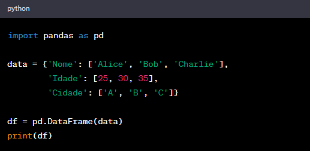
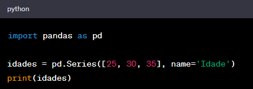

# Dataframes e Series - Estrutura dos Dados Parte - (estrutura - subtree)

__Certamente!__ Em Python, os DataFrames e Séries são estruturas de dados poderosas fornecidas pela biblioteca pandas, que é amplamente utilizada para manipulação e análise de dados. Aqui está um breve descritivo sobre cada um:

## DataFrame:
O DataFrame é uma estrutura de dados bidimensional e rotulada que se assemelha a uma tabela de banco de dados ou uma planilha do Excel. Ele é composto por colunas e linhas, onde cada coluna pode conter diferentes tipos de dados. O DataFrame é uma estrutura flexível e eficiente que oferece inúmeras funcionalidades para trabalhar com dados.

> ### - Principais características:
>

>> - ** Bidimensional**: Os dados são organizados em linhas e colunas.
>

>> - **Rotulado**: Cada coluna e linha possui rótulos que podem ser usados para acessar e manipular os dados.
>

>> - **Flexibilidade**: Suporta diferentes tipos de dados em cada coluna.
>

>> - **Operações**: Oferece uma ampla variedade de operações para filtrar, agrupar, combinar e transformar dados.

>>Exemplo:

>>

## Série:
> Uma Série é uma estrutura de dados unidimensional semelhante a uma matriz unidimensional, lista ou coluna em uma tabela. No entanto, a Série tem um índice associado que pode ser usado para acessar os elementos. É como uma coluna de um DataFrame.

> ### - Principais características:
>
>> - **Unidimensional**: Consiste em uma única dimensão de dados.
>
>> - **Rotulado**: Assim como os DataFrames, as Séries têm um índice associado para acessar os elementos.
Homogeneidade: Contém elementos de um único tipo de dados.

>> Exemplo:

>> 

Ambas as estruturas de dados são fundamentais para análise de dados em Python e são amplamente utilizadas em ciência de dados, manipulação de dados e outras tarefas relacionadas ao processamento de informações tabulares.

